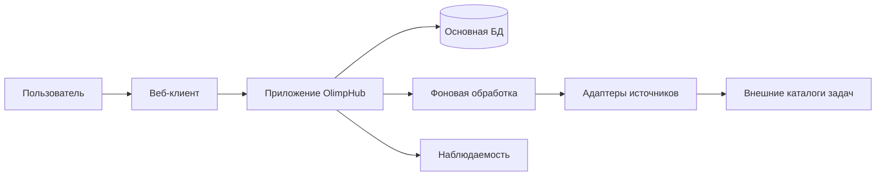
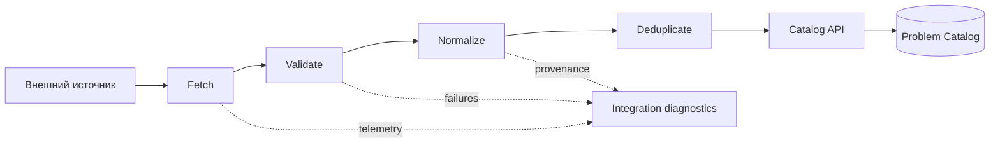

# Архитектура OlimpHub

**Статус:** утверждённый стартовый курс  
**Дата:** 14 августа 2026  
**Область:** веб-платформа для персональной подготовки к олимпиадам по программированию и математике

## 1. Контекст и цель

OlimpHub должен хранить и организовывать учебную работу пользователя вокруг задач: источники и условия, теги и навыки, попытки и решения, подборки и тренировочные сессии, персональные цели и аналитику. Главная сложность не в отображении списка задач, а в сохранении устойчивой предметной модели при добавлении новых источников и образовательных функций.

Архитектура должна обеспечивать предсказуемое развитие продукта без преждевременной сложности. Поэтому первоначальная реализация выбирает **модульный монолит**: единое развёртываемое приложение с изолированными модулями, явными интерфейсами и запретом на неявные зависимости между предметными областями.

> Модуль — это не папка по техническому признаку, а независимая часть предметной области со своими правилами, интерфейсами и тестами.

## 2. Архитектурные принципы

| Принцип                   | Решение в OlimpHub                                                                         | Практическое следствие                                                     |
| ------------------------- | ------------------------------------------------------------------------------------------ | -------------------------------------------------------------------------- |
| Власть доменной модели    | Внутренние сущности не повторяют структуру внешних сайтов.                                 | Новый источник подключается адаптером, а не изменением всего приложения.   |
| Модульный монолит         | Все модули поставляются вместе, но общаются только через публичные контракты.              | Низкая операционная сложность без хаотичной связности.                     |
| Контракты на границе      | HTTP, задания импорта, базы данных и сторонние API отделены от доменных правил.            | Тесты бизнес-правил не требуют сети, браузера или реальной БД.             |
| Эволюционность            | Сначала простые, измеримые решения; выделение сервиса — только при доказанной потребности. | Не создаются микросервисы, очереди и отдельные хранилища «на будущее».     |
| Безопасность по умолчанию | Минимальные права, секреты вне репозитория, проверка авторизации на сервере.               | Клиентский интерфейс не является границей доверия.                         |
| Наблюдаемость             | Ошибки, время ответов и исходы интеграций имеют структурированные события.                 | Деградации источников и регрессии можно обнаружить до жалоб пользователей. |

## 3. Контекст системы

Веб-клиент отвечает за представление, локальное состояние и доступный интерактивный опыт. Серверное приложение является единственным владельцем авторизации, доменных операций и доступа к данным. Адаптеры источников выполняются как фоновые операции, имеют ограниченные права и не могут напрямую изменять доменные таблицы без прохождения нормализации и валидации.

## 4. Доменные модули

| Модуль             | Ответственность                                                                     | Основные сущности                                  | Не входит в ответственность                                      |
| ------------------ | ----------------------------------------------------------------------------------- | -------------------------------------------------- | ---------------------------------------------------------------- |
| Identity           | Учётные записи, сессии, роли и настройки приватности.                               | User, Session, UserPreference                      | Учебная статистика и содержимое задач.                           |
| Problem Catalog    | Канонический каталог задач, версии условий, метаданные, теги и связи с источниками. | Problem, ProblemStatement, SourceLink, Tag         | Личные статусы пользователя.                                     |
| Skill Map          | Иерархия тем, навыков и зависимостей между ними.                                    | Skill, SkillRelation, SkillMapping                 | Автоматическое выставление уровня пользователя без явных правил. |
| Learning Workspace | Личные списки, заметки, статусы, попытки, решения и закладки.                       | ProblemProgress, Attempt, SolutionNote, Collection | Канонические данные внешнего каталога.                           |
| Training           | Цели, учебные планы и завершённые тренировочные сессии.                             | Goal, StudyPlan, TrainingSession, SessionItem      | Глобальное ранжирование задач.                                   |
| Analytics          | Снимки и агрегаты личного прогресса.                                                | ProgressSnapshot, SkillMetric                      | Изменение исходных событий пользователя.                         |
| Integrations       | Контракты адаптеров, импорт, дедупликация и диагностика источников.                 | Source, ImportRun, ExternalProblemRef              | Бизнес-правила интерфейса и обучения.                            |
| Notifications      | Настройки и доставка напоминаний в будущем.                                         | NotificationPreference, Notification               | Правила построения плана подготовки.                             |

Модуль может читать данные другого модуля только через его публичный интерфейс или специально подготовленную проекцию. Прямые обращения к внутренним репозиториям, таблицам или моделям другого модуля запрещены.

## 5. Слои внутри модуля

Каждый модуль следует направлению зависимостей **interface → application → domain ← infrastructure**. Это соглашение не требует сложного фреймворка, но требует разделять предметные правила и детали доставки.

| Слой           | Назначение                                                                   | Допустимые зависимости                      |
| -------------- | ---------------------------------------------------------------------------- | ------------------------------------------- |
| Interface      | HTTP-обработчики, схемы запросов, UI-контракты, обработчики фоновых заданий. | Application.                                |
| Application    | Сценарии: команды, запросы, транзакции, авторизация операции.                | Domain и публичные порты.                   |
| Domain         | Сущности, значения, инварианты, доменные события и политики.                 | Только стандартная библиотека и код домена. |
| Infrastructure | ORM, SQL, внешний HTTP, кэш, очередь, наблюдаемость.                         | Публичные порты Application/Domain.         |

Например, сценарий «пометить задачу решённой» принадлежит `Learning Workspace`: он проверяет принадлежность прогресса пользователю, фиксирует событие и передаёт агрегируемое событие модулю `Analytics`. Контроллер не изменяет строки базы напрямую и не рассчитывает статистику сам.

## 6. Каноническая модель задачи и интеграции

Независимость от источников — ключевой архитектурный инвариант. Базовая сущность `Problem` описывает задачу в терминах OlimpHub, а не конкретной платформы.

| Поле канонической задачи | Назначение                                                                 |
| ------------------------ | -------------------------------------------------------------------------- |
| `id`                     | Стабильный внутренний идентификатор.                                       |
| `title`                  | Отображаемое название.                                                     |
| `statements`             | Версионируемые локализованные варианты условия.                            |
| `kind`                   | Программирование, математика или смешанный формат.                         |
| `difficulty`             | Нормализованная шкала с указанием уверенности и происхождения.             |
| `skills`                 | Связи с картой навыков и вес релевантности.                                |
| `sourceLinks`            | Ссылки на оригинал, идентификатор источника и внешние метаданные.          |
| `availability`           | Доступность, дата последней проверки и причина ограничения, если известна. |
| `provenance`             | Время импорта, версия адаптера и данные для аудита преобразования.         |

Каждый адаптер реализует следующие логические этапы: получение данных, проверка схемы, преобразование во внутренний входной контракт, сопоставление-дедупликация и безопасное сохранение. Адаптер не должен обходить ограничения источника, собирать данные вне разрешённых способов или сохранять учётные данные в базе без шифрования.

Новые поставщики задач добавляются отдельным пакетом адаптера, контрактными тестами и конфигурацией `Source`; изменения ядра каталога допускаются только при расширении общего канонического контракта.

## 7. Данные и согласованность

На старте используется одна реляционная база данных с отдельными схемами или чёткими префиксами таблиц по модулю. Это даёт транзакционную надёжность для личных действий пользователя и при этом сохраняет возможность выделения владения данными позже.

| Вид данных           | Хранение                                                    | Политика                                                                           |
| -------------------- | ----------------------------------------------------------- | ---------------------------------------------------------------------------------- |
| Транзакционные       | Реляционная БД                                              | Внешние ключи, уникальные ограничения, миграции, резервное копирование.            |
| Поисковые проекции   | БД на старте; выделенный индекс при измеримой необходимости | Перестраиваемость из каталога и событий.                                           |
| Документы и вложения | Объектное хранилище                                         | Приватные ключи, краткоживущие подписанные ссылки, антивирусная проверка загрузок. |
| Кэш                  | Внешний кэш только для воспроизводимых данных               | Явный TTL и возможность полного сброса.                                            |
| Аналитические срезы  | Материализованные агрегаты                                  | Исходные события остаются источником достоверности.                                |

Любое изменение пользовательского прогресса формирует неизменяемое предметное событие. В одной транзакции сохраняются исходное состояние и запись в outbox; отдельный обработчик обновляет аналитические проекции. Это предотвращает потерю событий и не блокирует основной сценарий при временной ошибке аналитики.

## 8. API и пользовательский интерфейс

Публичный API создаётся по ресурсо- и сценарно-ориентированным контрактам, версионируется на уровне маршрутов или заголовков и сопровождается машиночитаемой схемой. Команды, которые меняют состояние, должны быть идемпотентны там, где клиент может повторить запрос из-за сбоя сети.

Интерфейс строится вокруг коротких пользовательских потоков: найти или сохранить задачу, начать попытку, зафиксировать результат, продолжить тренировку и увидеть следующий осмысленный шаг. Любая страница должна иметь явные состояния загрузки, пустого результата, ошибки и недоступности данных. Доступность, управление с клавиатуры, контраст и адаптивная вёрстка — критерии готовности интерфейса, а не отдельный этап после реализации.

## 9. Безопасность и приватность

| Риск                                       | Базовая защита                                                                                                         |
| ------------------------------------------ | ---------------------------------------------------------------------------------------------------------------------- |
| Несанкционированный доступ к личным данным | Проверка владельца и роли в каждом серверном сценарии; запрет полагаться на фильтрацию на клиенте.                     |
| Захват сессии                              | Безопасные HttpOnly-cookie, ротация сессии, ограничение времени жизни и отзыв активных сессий.                         |
| Утечка секретов                            | Только переменные окружения или менеджер секретов; секреты не попадают в Git, логи и клиентский пакет.                 |
| Инъекции и невалидные данные               | Строгая серверная валидация схем, параметризованные запросы, безопасное преобразование Markdown/HTML.                  |
| Злоупотребление API                        | Лимиты запросов, защита от перебора, аудит чувствительных операций и защита от CSRF там, где применимо.                |
| Ошибки интеграций                          | Отдельные учётные данные по источнику, минимальные права, таймауты, повторные попытки с ограничением и журналирование. |

Сбор данных ограничивается тем, что требуется для персонального обучения. До публичного запуска необходимо добавить политику приватности, экспорт данных пользователя и понятный процесс удаления аккаунта и личных данных.

## 10. Надёжность и производительность

Производительность измеряется по пользовательским операциям, а не по абстрактным техническим метрикам. Для каталога это поиск и открытие задачи, для обучения — фиксация попытки и загрузка текущего плана. Медленные операции импорта, массовый пересчёт аналитики и уведомления выполняются вне HTTP-запроса.

Система должна иметь структурированные логи с идентификатором запроса, метрики частоты ошибок и задержек, а также трассировку критичных сценариев. Персональные данные, токены, тексты заметок и полные условия задач не допускаются в технические логи без явной необходимости и соответствующей политики маскирования.

## 11. Стратегия тестирования

| Уровень          | Цель                                                        | Примеры                                                                |
| ---------------- | ----------------------------------------------------------- | ---------------------------------------------------------------------- |
| Модульные        | Проверить инварианты и правила домена.                      | Изменение статуса задачи, расчёт прогресса, нормализация сложности.    |
| Интеграционные   | Проверить взаимодействие адаптеров, БД и границ модулей.    | Миграции, outbox, импорт и дедупликация.                               |
| Контрактные      | Защитить API и адаптеры от несовместимых изменений.         | Схемы запросов, фикстуры источников, публичные события.                |
| Сквозные         | Проверить критичные пользовательские потоки.                | Вход, добавление задачи, попытка решения, просмотр прогресса.          |
| Нефункциональные | Подтвердить безопасность, доступность и ожидаемую нагрузку. | Проверка авторизации, аудит зависимостей, сценарии производительности. |

## 12. Технический курс реализации

Конкретный фреймворк выбирается в первом этапе реализации по критериям производительности команды, надёжной типизации, поддержке миграций, тестов и серверной авторизации. Независимо от выбранного стека, обязательны единый репозиторий, строгая типизация в прикладном коде, линтер, форматтер, миграции БД, тестовый контур и CI-проверки.

Отдельные микросервисы, поисковый движок, брокер сообщений и многоуровневое кеширование не являются стартовыми зависимостями. Они могут быть выделены только после появления конкретного узкого места, измерения его влияния и документации решения в архитектурной записи.

## 13. Принятые решения

| Решение                                                    | Статус    | Причина                                                                                             |
| ---------------------------------------------------------- | --------- | --------------------------------------------------------------------------------------------------- |
| Начать с модульного монолита                               | Принято   | Даёт самый короткий путь к качественному MVP при сохранении границ.                                 |
| Использовать каноническую модель задачи                    | Принято   | Защищает продукт от привязки к формату одного источника.                                            |
| Реализовать интеграции через адаптеры и задания            | Принято   | Изолирует нестабильные внешние системы и облегчает тестирование.                                    |
| Фиксировать события прогресса через outbox                 | Принято   | Делает аналитику восстанавливаемой и надёжной.                                                      |
| Ввести самостоятельные сервисы на старте                   | Отклонено | Нет доказанной нагрузки, а операционная стоимость преждевременна.                                   |
| Выбрать конкретный технологический стек до определения MVP | Отложено  | Стек должен следовать от согласованных пользовательских сценариев, а не заменять продуктовый выбор. |

## 14. Критерий следующего этапа

Можно начинать реализацию базового каркаса только после согласования MVP из дорожной карты: минимального набора пользовательских сценариев, первичной модели доступа и первого легального источника задач. Это ограничение намеренно: оно предотвращает одновременную разработку несвязанных функций и защищает архитектурный курс.
