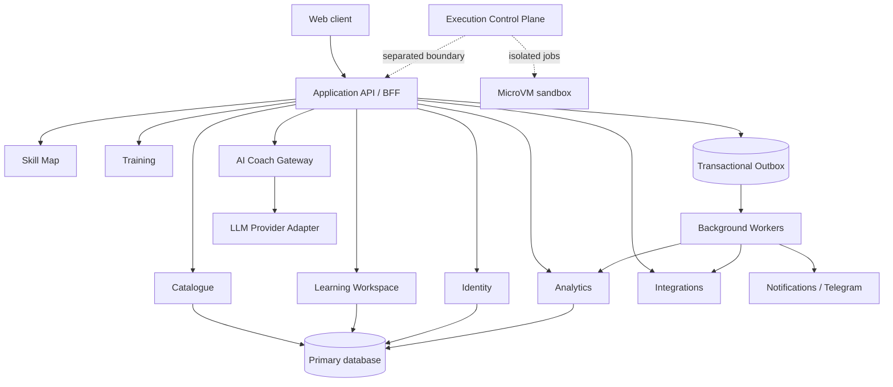

# Целевая архитектура OlimpHub

**Задача backlog:** P0-010  
**Статус:** базовая архитектура  
**Дата:** 14 августа 2026  
**Связанные документы:** [продукт](../product/PRODUCT_SPEC.md), [каталог](DATABASE.md), [безопасность](SECURITY.md)

## Архитектурный стиль

OlimpHub начинается как **модульный монолит с доменными границами и transactional outbox**. Это минимизирует операционную сложность первого релиза, сохраняет транзакционную целостность личного прогресса и не допускает, чтобы будущие integrations/AI/execution расползлись по UI. Модуль может быть вынесен только после появления измеримой независимой нагрузки, отдельного owner и стабильного контракта; преждевременные микросервисы не являются целью.

## Модули и ownership

| Модуль             | Владеет                                                                  | Публичный контракт                                       | Запрещённая зависимость                                 |
| ------------------ | ------------------------------------------------------------------------ | -------------------------------------------------------- | ------------------------------------------------------- |
| Identity           | users, sessions, roles, privacy preferences, account links.              | `CurrentIdentity`, account/link commands.                | Прямое чтение progress/attempt data.                    |
| Catalogue          | problems, source refs, content access, tags, imports, curator review.    | Поиск approved projections, source-aware problem detail. | Хранение личного status/notes.                          |
| Learning Workspace | attempts, notes, personal statuses, activity events.                     | Scoped attempt/progress commands and read models.        | Внешние API и skill calculations.                       |
| Skill Map          | skills, DAG, mapping policies, approved links.                           | Версионированный graph/read model.                       | Перезапись source tags или user evidence.               |
| Training           | training session/items, selection policy version.                        | Start/continue/complete training.                        | Самостоятельный доступ к чужим личным данным.           |
| Analytics          | rebuildable projections, snapshots, evidence explanations.               | Read-only metrics/reasons.                               | Direct UI write or policy-free mastery inference.       |
| Integrations       | source adapters, sync state, external submissions/accounts.              | Idempotent import jobs and normalized observations.      | Пароли/credentials клиента или UI-specific logic.       |
| AI Coach           | safe context builder, policy, provider abstraction, response validation. | Structured advice/hint response.                         | Direct DB access, write tools, authority over progress. |
| Notifications      | preferences, outbox delivery, channel adapters.                          | Schedule/cancel/track delivery.                          | Создавать learning facts без domain event.              |
| Execution          | job orchestration/result aggregation.                                    | Explicit job lifecycle.                                  | Работа в API process/общей инфраструктуре приложения.   |

## Данные и связи

Каждый модуль владеет своими таблицами/моделями и публикует DTO/read-model, а не ORM entity. Внутри общего database схема/namespace отражает ownership; cross-module reference использует opaque ID и не создаёт cascade delete через границы. Ссылки на source problem, user, attempt и skill согласуются с `DATABASE.md`, `LEARNING_DATA.md` и `SKILL_TAXONOMY.md`.

Изменяющая команда выполняется в транзакции модуля, записывает domain event в `outbox` и возвращает подтверждённый ресурс. Worker публикует событие с идемпотентным consumer key; downstream projections можно пересчитать. Внешняя доставка не является частью синхронной HTTP-транзакции.

| Тип взаимодействия  | Пример                                                              | Правило                                                                       |
| ------------------- | ------------------------------------------------------------------- | ----------------------------------------------------------------------------- |
| Синхронная команда  | Start attempt, update note, link account.                           | Авторизация, schema validation, idempotency key, atomic local write + outbox. |
| Синхронное чтение   | Catalogue filters, current workspace, dashboard.                    | Только read-model/DTO; pagination и policy-filter.                            |
| Асинхронное событие | Attempt completed → analytics, external sync → progress projection. | At-least-once delivery, idempotent consumer, versioned payload.               |
| Внешний вызов       | Codeforces, Telegram, LLM provider.                                 | Adapter, timeout, retry policy, circuit breaker, audit/provenance.            |
| Высокорисковый job  | Compile/run user code.                                              | Отдельный control plane и isolated execution boundary.                        |

## API conventions

API — versioned JSON HTTP endpoints для client-facing сценариев; internal модульные контракты являются типизированными application services, а не «внутренним REST». Каждый endpoint получает authenticated actor из server session, отклоняет unknown/invalid input, использует stable error code и возвращает только permission-filtered DTO. `POST` для создающих действий поддерживает idempotency key; cursor pagination стабильно сортирует по документированному ключу.

Ошибки имеют структуру `{ code, message, fieldErrors?, requestId }`; `message` безопасна для пользователя, а подробность идёт в redacted server log. Нет endpoint, который принимает `userId` как источник authority, raw SQL filter, произвольный model/tool command, source URL для server fetch или execution limits.

## Надёжность и масштабирование

| Сценарий                      | Решение                                                                                                        |
| ----------------------------- | -------------------------------------------------------------------------------------------------------------- |
| Внешний source/API недоступен | Catalogue показывает approved cached snapshot и source health; import retry backoff, no user request blocking. |
| Worker повторно получил job   | Consumer dedupe/idempotency key; no duplicate notification/progress event.                                     |
| Analytics отстали             | UI показывает generatedAt/calculation version; исходные facts сохраняются, projection rebuildable.             |
| Provider AI unavailable       | Return explicit degraded response; baseline workspace работает без AI.                                         |
| Telegram delivery failure     | Outbox retry/final status, не блокирует доменное событие.                                                      |
| Execution plane failure       | `JUDGE_ERROR` без компрометации API/DB; resources reconciled.                                                  |

Наблюдаемость строится по request/job correlation ID, structured logs с redaction, метрикам latency/error/backlog и tracing across asynchronous boundaries. Бизнес-метрики не заменяют security audit, а audit не содержит raw code/notes/secrets.

## Deployment topology

Web client и application API являются обычным приложением; primary database, object storage, cache/queue и secret manager — managed/защищённые инфраструктурные компоненты. Workers имеют минимальные credentials и не используют browser secrets. AI provider и Telegram находятся за server-side adapter. Execution hosts/managed runtime размещаются в отдельно изолированной среде без маршрута к primary data plane.

Развёртывания содержат dev, preview/staging и production с разными секретами/данными. Миграции backward-compatible, feature flags используются для integrations/AI/execution, rollback не уничтожает факты. Production credentials никогда не используются в локальных fixtures.

## Evolution rules

1. Новый модуль добавляется с owner, domain boundary, data ownership, synchronous/async contract и тестовой стратегией.
2. Событие получает schema version и additive evolution; consumers терпимы к неизвестным полям.
3. Перенос модуля в service начинается с contract tests, event replay и runtime evidence, а не с предположения о будущем масштабе.
4. Новый external provider проходит adapter contract, source/security review и failure-mode tests.
5. Новая функция не может обходить privacy/security/repository documentation: изменение границ обновляет соответствующий документ и BACKLOG.
