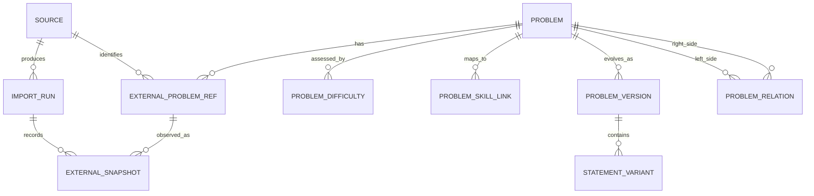

# Каноническая модель задач и данных каталога

**Задача backlog:** P0-004  
**Статус:** завершено  
**Дата:** 14 августа 2026  
**Владелец домена:** `Problem Catalog`  
**Связанные документы:** [Codeforces API](../data/CODEFORCES_API.md), [оценка других источников](../data/OTHER_SOURCES.md), [архитектура](../architecture.md)

## 1. Цель и границы

Модель описывает задачу как учебный объект OlimpHub, а не как строку ответа Codeforces, страницу AtCoder или URL CSES. Она должна позволять добавить новый источник без миграции личного прогресса пользователя, сохранить происхождение каждого импортированного поля, работать с частично доступными данными и не копировать контент за пределами разрешённых прав.

Каноническая задача — это не предположение, что две похожие задачи одинаковы. До явного или проверяемого сопоставления каждая внешняя задача остаётся отдельным `Problem`; будущая дедупликация может связать дубли, но не уничтожает исходные ссылки и никогда не объединяет личную историю автоматически без безопасного правила.

> Происхождение в OlimpHub — это не просто URL. Для каждого снимка внешней сущности фиксируются источник, действие импорта, время наблюдения, версия адаптера и хэш нормализованных данных. Такой подход следует базовому различению сущностей, действий и ответственных агентов в W3C PROV.[1]

## 2. Инварианты

| Идентификатор | Инвариант                                                                                                                                   | Причина                                                                  |
| ------------- | ------------------------------------------------------------------------------------------------------------------------------------------- | ------------------------------------------------------------------------ |
| PC-001        | Внутренний `Problem.id` стабилен и не зависит от URL, рейтинга, названия или тега источника.                                                | Метаданные внешней платформы могут меняться.                             |
| PC-002        | Внешняя ссылка задачи уникальна в пределах `Source` по нормализованному `externalKey`.                                                      | Повторный импорт не создаёт дубль.                                       |
| PC-003        | Любая автоматическая запись каталога имеет `observedAt`, `importRunId`, `adapterVersion` и `normalizedPayloadHash`.                         | Поддерживаются аудит, идемпотентность и расследование ошибок.            |
| PC-004        | Отсутствующее значение — это неизвестное значение, а не ноль, пустая строка или «лёгкая» задача.                                            | Источники могут не отдавать рейтинг, баллы, тег или условие.             |
| PC-005        | Условие, примеры, тесты и вложения хранятся локально только в рамках `Source.contentScope`.                                                 | Защищаются права источника и пользователей.                              |
| PC-006        | Личная активность и решения не принадлежат `Problem Catalog`; они ссылаются на `Problem.id` через публичный контракт.                       | Импорт/слияние каталога не должен менять личную историю.                 |
| PC-007        | Нормализованная сложность хранит метод и происхождение; оценка одного источника не выдаётся за универсальную истину.                        | Шкалы Codeforces, Kattis и других источников несопоставимы по умолчанию. |
| PC-008        | Автоматическое canonical-слияние допускается только при доказуемом совпадении внешнего идентификатора или вручную подтверждённом отношении. | Предотвращается потеря контекста и ошибочное объединение похожих задач.  |

## 3. Предметная схема



| Сущность             | Назначение                                                            | Ключевые поля                                                                                                             |
| -------------------- | --------------------------------------------------------------------- | ------------------------------------------------------------------------------------------------------------------------- |
| `Source`             | Реестр поставщика и разрешённого режима данных.                       | `id`, `providerKey`, `accessMode`, `contentScope`, `rightsBasis`, `status`.                                               |
| `Problem`            | Стабильный учебный объект OlimpHub.                                   | `id`, `kind`, `lifecycleStatus`, `canonicalizationStatus`, `createdAt`.                                                   |
| `ExternalProblemRef` | Одна внешняя идентичность задачи из конкретного источника.            | `id`, `sourceId`, `problemId`, `externalKey`, `originalUrl`, `externalContestKey`, `firstObservedAt`, `lastObservedAt`.   |
| `ProblemVersion`     | Версия отображаемых канонических метаданных.                          | `id`, `problemId`, `versionNumber`, `title`, `kind`, `publishedAt`, `changeReason`.                                       |
| `StatementVariant`   | Разрешённый локальный вариант условия или только ссылка.              | `id`, `problemVersionId`, `locale`, `storageMode`, `content`, `contentUrl`, `contentHash`, `licenseScope`.                |
| `ProblemDifficulty`  | Оценка сложности с происхождением.                                    | `id`, `problemId`, `scale`, `value`, `sourceId`, `method`, `confidence`, `observedAt`.                                    |
| `ProblemSkillLink`   | Связь с независимой картой навыков.                                   | `problemId`, `skillId`, `relevance`, `origin`, `reviewStatus`.                                                            |
| `ImportRun`          | Одно запускаемое действие адаптера.                                   | `id`, `sourceId`, `trigger`, `status`, `startedAt`, `finishedAt`, `adapterVersion`, `cursorBefore`, `cursorAfter`.        |
| `ExternalSnapshot`   | Нормализуемый снимок внешнего ответа, нужный для аудита и diff.       | `id`, `externalProblemRefId`, `importRunId`, `observedAt`, `payloadSchemaVersion`, `normalizedPayloadHash`, `changeKind`. |
| `ProblemRelation`    | Явная связь задач, в том числе потенциальный/подтверждённый дубликат. | `leftProblemId`, `rightProblemId`, `relationType`, `confidence`, `origin`, `reviewStatus`.                                |

## 4. `Problem`: стабильное ядро

`Problem` создаётся в момент появления новой внешней задачи либо создания собственной/лицензированной задачи. Это намеренно небольшой агрегат: изменчивые поля вынесены в версии и оценки, чтобы обновление названия или рейтинга не меняло идентичность задачи.

| Поле                     | Тип/пример                                                                | Правило                                                                                             |
| ------------------------ | ------------------------------------------------------------------------- | --------------------------------------------------------------------------------------------------- |
| `id`                     | UUID/ULID                                                                 | Генерируется OlimpHub; публично безопасен для URL.                                                  |
| `kind`                   | `programming`, `mathematics`, `hybrid`                                    | `mathematics` и `hybrid` разрешены уже сейчас, хотя интерфейс MVP ориентирован на программирование. |
| `lifecycleStatus`        | `active`, `unavailable`, `archived`, `restricted`                         | Не удалять задачу автоматически при временной недоступности источника.                              |
| `canonicalizationStatus` | `source_distinct`, `candidate_duplicate`, `linked_duplicate`, `canonical` | По умолчанию `source_distinct`; нет неявного merge.                                                 |
| `createdAt`              | UTC timestamp                                                             | Время создания внутренней сущности.                                                                 |
| `createdBy`              | `source_import`, `curator`, `licensed_author`                             | Объясняет происхождение внутренней записи.                                                          |

Заголовок не хранится в `Problem`: его версия может меняться при исправлении внешнего источника или локализации. При чтении каталог использует актуальную опубликованную `ProblemVersion`, а история остаётся доступна для аудита.

## 5. Внешняя идентичность и адаптеры

Каждый адаптер обязан построить детерминированный `externalKey`; он не опирается только на title. Предлагаемые форматы задают соглашение, а не требования к URL:

| Источник           | Пример `externalKey`                          | Объяснение                                                                                                                                                           |
| ------------------ | --------------------------------------------- | -------------------------------------------------------------------------------------------------------------------------------------------------------------------- |
| Codeforces         | `contest:{contestId}:problem:{index}`         | Основан на `contestId` и `index`, которые входят в официальный объект `Problem`; `problemsetName` поддерживается отдельным полем, потому что может отсутствовать.[2] |
| AtCoder            | `contest:{contestSlug}:task:{taskScreenName}` | Идентификаторы извлекаются только через разрешённый способ доступа.                                                                                                  |
| CSES               | `task:{numericTaskId}`                        | Стабильный идентификатор в URL фиксируется вместе с полной внешней ссылкой.                                                                                          |
| Kattis             | `problem:{slug}`                              | Slug фиксируется вместе с хостом/контекстом архива, чтобы не спутать разные инсталляции.                                                                             |
| Собственная задача | `olymphub:{publicSlug}`                       | Создаётся приложением и не имитирует чужую идентичность.                                                                                                             |

Ограничение уникальности: `UNIQUE(source_id, external_key)`. Смена URL не создаёт новую сущность, если адаптер подтвердил ту же внешнюю идентичность. Если источник меняет ключ без надёжной связи, создаётся новая ссылка и `ProblemRelation` типа `possible_same_problem` до ручного решения.

## 6. Версии, условия и доступ к контенту

`ProblemVersion` содержит нормализованные отображаемые поля: `title`, `kind`, `sourceDisplayLabel`, `primaryExternalRefId`, `summary`, `inputFormat`, `outputFormat`, `constraintsSummary` и `publishedAt`. Поля `summary`, `inputFormat` и аналогичные могут иметь значение только тогда, когда `Source.contentScope` разрешает их хранение. В `external_link` режиме версия содержит только непроизводные метаданные и URL оригинала.

`StatementVariant.storageMode` принимает значения:

| Режим                 | Допустимые данные                                             | Правило чтения                                             |
| --------------------- | ------------------------------------------------------------- | ---------------------------------------------------------- |
| `external_link`       | `contentUrl`, `sourceAttribution`, время проверки.            | Интерфейс открывает оригинал; текст условия не кэшируется. |
| `licensed_inline`     | Санитизированный текст и локальные разрешённые вложения.      | Отображается с атрибуцией, локалью, лицензией и версией.   |
| `restricted_metadata` | Только название/ограниченный description, если это разрешено. | Интерфейс не пытается восстановить полное условие.         |
| `withdrawn`           | Ссылка на запись об отзыве/ограничении.                       | Контент скрыт, личный прогресс сохраняется.                |

Для локалей применяется валидируемая BCP 47-метка, например `ru`, `en`, `en-US`; локаль оригинала и локаль перевода не смешиваются. Перевод хранится отдельным вариантом со своим автором, статусом проверки и лицензией.

## 7. Сложность, теги и навыки

Внешние теги и навыки имеют разную природу. Внешние теги хранятся как сохранённые исходные метаданные в снимке/версии, а связи с навыками принадлежат карте навыков OlimpHub. Нельзя приравнять строку `dp` или `math` конкретного источника к учебной компетенции без правила сопоставления.

| Данные                  | Модель                                                                                         | Пример                                                  |
| ----------------------- | ---------------------------------------------------------------------------------------------- | ------------------------------------------------------- |
| Внешний тег             | `ExternalTagObservation` внутри версии/снимка: `sourceId`, `value`, `locale`, `observedAt`.    | `dp`, `graphs` из Codeforces.                           |
| Внешняя оценка          | `ProblemDifficulty` с `scale=codeforces_rating`, `value=1600`, `method=source_published`.      | Не преобразуется автоматически в универсальный уровень. |
| Нормализованный уровень | `ProblemDifficulty` с `scale=olymphub_band`, `value=intermediate_2`, `method=calibrated_rule`. | Добавляется только после документации калибровки.       |
| Навык                   | `ProblemSkillLink` на `Skill Map`; связь имеет `relevance` от 0 до 1 и `origin`.               | `dynamic-programming` с `origin=curator`.               |

`confidence` относится к уверенности в оценке/сопоставлении, а не к уверенности пользователя. Если нет проверенной калибровки, у задачи может быть только исходная оценка и пустой нормализованный band.

## 8. Импорт, снимки и идемпотентность

Полный жизненный цикл импорта:

1. Адаптер получает ответ только разрешённым способом и валидирует его на границе.
2. `ImportRun` фиксирует источник, версию адаптера, запуск, входной cursor и статус.
3. Для каждой внешней задачи адаптер строит `externalKey` и каноническое представление разрешённых данных.
4. Вычисляется `normalizedPayloadHash` на нормализованных полях, без секретов и случайного порядка ключей.
5. Существующая `ExternalProblemRef` обновляет `lastObservedAt`; новая создаётся только при отсутствии уникального ключа.
6. Если хэш изменился, создаётся `ExternalSnapshot` и новая `ProblemVersion` при изменении отображаемых данных.
7. Cursor продвигается только после успешного сохранения всего определённого атомарного сегмента; ошибка оставляет данные и cursor прежними.

Повтор одного и того же ответа создаёт максимум новую отметку наблюдения и не создаёт дубликат `Problem`, `ExternalProblemRef` или `ProblemVersion`. Частичный ответ не помечает отсутствующие задачи как удалённые. Отзыв/исчезновение источника изменяет `availability` только при отдельном подтверждённом правиле, а не от одного пропуска в снимке.

## 9. Связи задач и будущая дедупликация

`ProblemRelation` хранит направленные отношения: `same_problem`, `translation_of`, `adapted_from`, `duplicate_candidate`, `prerequisite`, `follow_up` и `variant_of`. Для симметричных отношений приложение записывает пару в нормализованном лексикографическом порядке ID, чтобы избежать дублей. `same_problem` требует `reviewStatus=approved` и не удаляет ни одну из записей.

Будущий пользовательский слой выбирает одну «предпочтительную» внешнюю ссылку для отображения, но личные попытки и отправки остаются привязаны к исходной `Problem.id`. Слияние `Problem` возможно только как отдельная миграция с журналом переназначений, обратимостью и тестами — P1-304 не имеет права выполнять разрушительный merge по названию, хэшу текста или совпадению тегов.

## 10. Публичный read-контракт

Интерфейс и внешний API получают безопасную проекцию, а не сырые таблицы источника:

```json
{
  "id": "01J...",
  "title": "...",
  "kind": "programming",
  "availability": "active",
  "source": {
    "displayName": "Codeforces",
    "url": "https://...",
    "accessMode": "external_link",
    "attribution": "Codeforces"
  },
  "difficulty": {
    "sourceScale": "codeforces_rating",
    "sourceValue": 1600,
    "normalizedBand": null,
    "observedAt": "2026-08-14T00:00:00Z"
  },
  "skills": [],
  "statement": {
    "mode": "external_link",
    "url": "https://...",
    "locale": "en"
  },
  "provenance": { "lastObservedAt": "2026-08-14T00:00:00Z" }
}
```

Проекция не включает технические `payloadHash`, внутренние cursor, диагностические ошибки, непубличные ссылки, персональные данные и какие-либо секреты. Ссылки источника проверяются на допустимую схему `https`, известный host для `Source` и отсутствие учётных параметров.

## 11. Правила удаления и ретенции

Каталожные записи не удаляются каскадно вместе с `Source` или `ExternalProblemRef`, так как на них ссылаются личные попытки, тренировки и аналитика. При отзыве разрешения локальный контент немедленно переводится в `withdrawn` и удаляется согласно документированной политике ретенции; остаётся минимальная обезличенная запись для согласованности личной истории: внутренний ID, атрибуция источника, время отзыва и причина. Политика удаления персональных данных является отдельной задачей безопасности и не смешивается с правами на условия задач.

## 12. Проверяемые критерии будущей реализации

| Критерий                                                     | Обязательный тест                                                                           |
| ------------------------------------------------------------ | ------------------------------------------------------------------------------------------- |
| Один и тот же `sourceId + externalKey` импортируется дважды. | В БД остаётся одна `ExternalProblemRef` и один `Problem`; import run отражает повтор.       |
| Внешний `Problem` без rating, points или tags.               | Внутренняя запись проходит валидацию без вымышленных значений.                              |
| Изменилось только число решивших.                            | Создаётся/обновляется наблюдение статистики, но не новая версия заголовка или новая задача. |
| Изменился title/набор тегов.                                 | Появляется новая версия/снимок с причиной изменения; старая остаётся в истории.             |
| Источник в `external_link` режиме передаёт полный текст.     | Валидация отклоняет локальное хранение текста и фиксирует безопасную ошибку.                |
| Две задачи имеют одинаковый title.                           | Они остаются разными `Problem`, пока связь не подтверждена.                                 |
| Источник пропал из одного частичного снимка.                 | Задача не удаляется и не теряет личные связи.                                               |

## 13. Последствия для последующих задач

P0-005 ссылается на `Problem.id`, но не дублирует сведения о задаче в активности/отправке. P0-006 создаёт `Skill`, на который указывает `ProblemSkillLink`. P1-301 реализует типизированный адаптер и `ImportRun`; P1-304 реализован как nondestructive canonicalization поверх `ProblemRelation`: пара нормализуется по ID, предложение и review выполняются только администратором, а approval `same_problem` меняет только явный status обеих исходных записей. P1-401—P1-404 связывают внешние отправки пользователя с `ExternalProblemRef`, а не с URL или названием.

## References

[1]: https://www.w3.org/TR/prov-dm/ "W3C — PROV-DM: The PROV Data Model"
[2]: https://codeforces.com/apiHelp/objects "Codeforces API — Objects"
