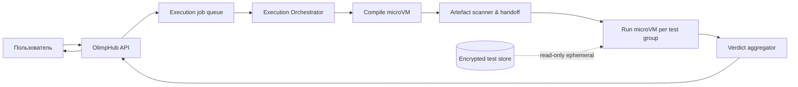

# Архитектура безопасного выполнения пользовательского кода

**Задача backlog:** P0-008  
**Статус:** завершено  
**Дата:** 14 августа 2026  
**Владельцы доменов:** `Execution`, `Security & Reliability`  
**Связанные документы:** [модель учебных данных](LEARNING_DATA.md), [архитектура](../architecture.md)

## 1. Решение

Недоверенный код пользователя **никогда не запускается** в процессе веб-приложения, API-сервера, фонового воркера импорта, CI runner или обычного контейнера приложения. Выполнение происходит в отдельной плоскости исполнения, в одноразовом изолированном окружении на задание. Production-граница по умолчанию — аппаратно изолированная microVM; контейнерные namespaces, cgroups и seccomp являются дополнительной защитой, а не единственным барьером.

Firecracker запускает нагрузки в лёгких microVM с аппаратной виртуализацией и минимальной моделью устройств, специально сокращающей поверхность атаки.[1] gVisor предоставляет полезную дополнительную изоляцию недоверенного кода, но его собственная документация подчёркивает необходимость defence-in-depth и то, что разные клиенты должны работать в разных sandbox.[2] Поэтому gVisor допустим для локальной разработки и как дополнительный runtime, но не заменяет отдельную production-гостевую границу для multi-tenant judge.

> До готовности отдельного изолированного execution environment пользовательский запуск кода остаётся выключенной функцией. Нельзя заменять его запуском в Docker на хосте приложения, имитацией вердикта или выполнением в CI.

## 2. Граница доверия

| Компонент                       | Уровень доверия                    |              Может содержать секреты |                 Может запускать пользовательский код |
| ------------------------------- | ---------------------------------- | -----------------------------------: | ---------------------------------------------------: |
| Веб-клиент                      | Недоверенный                       |                                  Нет |                                                  Нет |
| API / модуль Learning Workspace | Доверенный control plane           | Только необходимые сервисные секреты |                                                  Нет |
| Очередь заданий                 | Частично доверенная инфраструктура |                        Нет в payload |                                                  Нет |
| Execution Orchestrator          | Доверенный control plane           |         Краткоживущий job capability |                                                  Нет |
| MicroVM launcher / worker host  | Высокий риск, усиленно защищённый  |          Минимальный host credential |                        Только через microVM boundary |
| Compile microVM                 | Недоверенный workload              |                                  Нет |                        Да, только compiler/toolchain |
| Run microVM                     | Недоверенный workload              |                                  Нет | Да, только скомпилированный artefact и тестовый ввод |
| Хранилище тестов                | Доверенное                         |          Тесты могут быть секретными |                                                  Нет |

Секретные тесты никогда не попадают в API, браузер, prompt AI Coach, логи, stdout ответ приложения или долговременное хранилище пользователя. Рабочая microVM не получает сетевых учётных данных, cloud instance metadata, Docker socket, host mounts, API tokens, ключи подписи, shared volume или доступ к базе.

## 3. Архитектурный поток

1. API валидирует запрос, авторизацию, лимит пользователя и право запускать конкретную задачу; он создаёт `ExecutionJob` без кода в логах.
2. Orchestrator выдаёт одноразовый capability с минимальным scope и помещает задание в изолированную очередь.
3. Compile microVM получает только исходный код, allowlisted toolchain и ограниченный scratch filesystem; результат — artefact или compilation diagnostics.
4. Artefact передаётся в run-среду через проверяемое одноразовое хранилище; compile microVM не разделяет runtime filesystem с run microVM.
5. Каждая группа тестов выполняется в чистой run microVM с read-only тестовым вводом, без сети и без persistence между заданиями.
6. Aggregator нормализует результат, ограничивает diagnostics, фиксирует resource usage и уничтожает все ephemeral resources независимо от исхода.

Compile и run разделены намеренно: компилятор обрабатывает особенно сложный недоверенный ввод, а бинарник способен атаковать runtime. Разделение уменьшает стойкость атаки и не позволяет ошибке одного этапа увидеть файлы/сокеты другого.

## 4. Минимальный контракт Execution

| Объект             | Поля                                                                                                            | Ограничения                                                                       |
| ------------------ | --------------------------------------------------------------------------------------------------------------- | --------------------------------------------------------------------------------- |
| `ExecutionRequest` | `attemptId`, `languageId`, `sourceCode`, `testScope`, `clientRequestId`                                         | `attemptId` проверяется server-side; исходник ограничен размером и не логируется. |
| `ExecutionJob`     | `jobId`, `userId`, `problemId`, `policyVersion`, `limits`, `queuedAt`, `expiresAt`                              | Публичный API не позволяет подменить `userId`, `problemId` или лимиты.            |
| `LanguageProfile`  | `languageId`, `compilerImageDigest`, `compileCommandTemplate`, `runCommandTemplate`, `enabled`                  | Immutable digest; нет пользовательской командной строки или package install.      |
| `ExecutionLimits`  | `wallTimeMs`, `cpuTimeMs`, `memoryBytes`, `pidsMax`, `outputBytes`, `fileBytes`, `sourceBytes`, `compileTimeMs` | Берутся из политики задачи/языка, а не от клиента.                                |
| `ExecutionResult`  | `verdict`, `phase`, `exitCode?`, `timeMs`, `memoryBytes`, `diagnostics?`, `testSummary`                         | Не включает скрытый input, expected output, VM path или host metadata.            |
| `ExecutionAudit`   | `jobId`, `policyVersion`, `imageDigest`, `isolationBackend`, `outcome`, `cleanupStatus`                         | Хранит технический audit без кода и тестовых данных.                              |

Идемпотентность обеспечивается `UNIQUE(user_id, client_request_id)` в коротком окне: повтор сетевого запроса возвращает один и тот же job/result, а не запускает программу дважды. Job имеет конечный срок жизни; отменённое или просроченное задание не может быть взято воркером после `expiresAt`.

## 5. Обязательные слои изоляции

| Слой                       | Обязательное требование                                                                        | Почему одного этого слоя недостаточно                                       |
| -------------------------- | ---------------------------------------------------------------------------------------------- | --------------------------------------------------------------------------- |
| Отдельный compute plane    | Не размещать runner на API-host или в общем Kubernetes node без доказуемой workload isolation. | Компрометация runner не должна стать компрометацией приложения/БД.          |
| MicroVM                    | Firecracker/KVM или эквивалентная hardware-virtualized граница на job.                         | Hypervisor/host остаются частью доверенной базы.                            |
| Immutable image            | Подписанный/пиннингованный rootfs и compiler image; обновления через проверенный pipeline.     | Не ограничивает CPU, сеть или доступ к излишне смонтированным файлам.       |
| UID/GID и capabilities     | Непривилегированный пользователь, no-new-privileges, drop all capabilities.                    | Ошибки в kernel/runtime требуют следующего слоя.                            |
| Namespaces / seccomp / LSM | User, mount, pid, net namespaces; минимальный syscall policy; MAC policy.                      | Универсальный syscall allowlist трудно сделать достаточным для всех языков. |
| cgroups v2                 | Жёсткие CPU/memory/pids/I/O limits с kill on breach.                                           | Не блокирует тайминговые атаки, доступ к сети или файловой системе.         |
| Network                    | `network=none`; нет DNS, loopback-сервисов, metadata endpoint, egress/ingress.                 | Не заменяет filesystem и process isolation.                                 |
| Filesystem                 | Read-only root, пустой tmpfs с quota, no host bind mounts, no device nodes.                    | Вредоносный процесс всё ещё можно перегрузить ресурсами без cgroup.         |
| Жизненный цикл             | Уничтожение VM/disks/sockets/cgroups после каждого job.                                        | Не защищает от атаки во время выполнения.                                   |

Разработка и production не могут использовать `runsc do` как готовую настройку: документация gVisor предупреждает, что convenience-команда даёт read-only доступ ко всей filesystem хоста; реальные конфигурации должны явно ограничивать mounts.[2]

## 6. Политика ресурсов и вердиктов

| Ресурс/событие                         | Технический контроль                                                   | Вердикт                                               |
| -------------------------------------- | ---------------------------------------------------------------------- | ----------------------------------------------------- |
| Ошибка компиляции                      | Отдельная compile microVM, ограниченный wall/CPU/output.               | `COMPILATION_ERROR`                                   |
| Ненулевой exit code/сигнал             | PID 1 wrapper и result collector.                                      | `RUNTIME_ERROR` (если не классифицирован иначе)       |
| CPU лимит                              | cgroup CPU accounting + watchdog.                                      | `TIME_LIMIT_EXCEEDED`                                 |
| Wall-clock timeout                     | Независимый host watchdog, не доверяющий гостевым часам.               | `TIME_LIMIT_EXCEEDED`                                 |
| Memory limit/OOM                       | cgroup memory.max + OOM event observation.                             | `MEMORY_LIMIT_EXCEEDED`                               |
| Превышение процессов                   | cgroup `pids.max`; особый предел для compiler/run профилей.            | `RUNTIME_ERROR` с внутренним reason `process_limit`   |
| Превышение output                      | Pipe/read cap, немедленное прекращение процесса.                       | `OUTPUT_LIMIT_EXCEEDED`                               |
| Файловая квота                         | Tmpfs/project quota; read-only root.                                   | `RUNTIME_ERROR` с внутренним reason `file_limit`      |
| Несовпадение вывода                    | Streaming comparator без передачи expected output пользователю.        | `WRONG_ANSWER`                                        |
| Успех всех открытых/разрешённых тестов | Aggregator получает только booleans/ограниченные диагностические поля. | `ACCEPTED`                                            |
| Неисправность sandbox/host             | Не интерпретировать как ошибку решения.                                | `JUDGE_ERROR`; повторить только по безопасной policy. |

Численные лимиты принадлежат `Problem`/`LanguageProfile` и определяются до запуска. Параметры не берутся из user request и не допускают «безлимитный» режим для администратора через публичный API.

## 7. Сеть, файлы и ввод-вывод

Run microVM не имеет виртуального сетевого интерфейса. Даже loopback не используется для сервисов; отсутствуют DNS, proxy variables, AWS/GCP metadata route, host PID namespace, UNIX sockets host runtime и устройства, не необходимые для работы языка. Системные часы/entropy не должны быть источником секрета; при необходимости используются контролируемые виртуальные device, а не host passthrough.

Input подаётся через read-only файл или pipe, output читается ограниченным pipe. Программа не получает список тестов, ожидаемый output, полный набор test groups или абсолютные пути. Ошибки компиляции и runtime stdout/stderr считаются недоверенным текстом: они ограничиваются, очищаются перед Markdown/HTML rendering и никогда не используются как инструкции AI Coach.

## 8. Языки и образ среды

Первый исполнимый язык — C++ в P0-502. Каждая language profile включает фиксированную версию toolchain, непроницаемый digest образа, разрешённый entrypoint и список допустимых флагов. Установка пакетов в процессе job, динамическая загрузка произвольных toolchain, shell из пользовательского параметра и запуск сетевых package manager запрещены.

Поддержка нового языка — security change: она требует отдельного threat review, profile fixture, syscall/capability review, лимитов компилятора, adversarial suite и документации. «Скомпилировалось локально» не является основанием включить runtime пользователям.

## 9. Логи, артефакты и приватность

| Данные                   | Допустимое хранение                                                           | Запрет                                                              |
| ------------------------ | ----------------------------------------------------------------------------- | ------------------------------------------------------------------- |
| Исходный код             | Только если пользователь явно сохраняет его в workspace; доступ по владельцу. | Попадание в обычные observability-логи, prompt AI, error tracker.   |
| Compile diagnostics      | Ограниченный размер, привязка к job, короткая retention policy.               | HTML без sanitization, включение host path.                         |
| Runtime stdout/stderr    | Ограниченный вывод в result по настройке пользователя.                        | Вывод hidden tests, environment variables или технических секретов. |
| Бинарник/temporary files | Только ephemeral storage.                                                     | Долгосрочная reuse между users/jobs.                                |
| Secret tests             | Encrypted trusted store + ephemeral read-only injection.                      | Ответ API, client, model provider, log/trace.                       |
| Audit                    | Метаданные job, image/policy version, verdict, cleanup status.                | Код, входные/ожидаемые данные, ключи.                               |

## 10. Операционная защита

Execution hosts выделяются в отдельный account/project/VPC и не имеют маршрута к primary database или внутренним control-plane endpoints, кроме узкого authenticated orchestrator channel. Host OS и hypervisor регулярно обновляются; host имеет минимальный набор сервисов, kernel hardening, централизованные security logs и emergency kill switch, отключающий приём новых job при признаках breakout/аномалий.

Для каждого job обязательны cleanup acknowledgement и reconciler: если worker потерял соединение, control plane помечает job неизвестным, а reconciler уничтожает orphan microVM, disk, cgroup, vsock/IPC endpoint и capability token. Невозможность подтвердить cleanup является security incident, а не обычной ошибкой компиляции.

## 11. Threat model и обязательные adversarial tests

P0-501 расширит threat model конкретным deployment environment, однако базовые тесты нельзя откладывать:

| Атака/сбой                            | Ожидаемый результат                                                                                  |
| ------------------------------------- | ---------------------------------------------------------------------------------------------------- |
| Fork bomb / process tree              | Превышение `pids.max`, убийство cgroup, host остаётся доступен.                                      |
| Infinite loop / busy spin             | Независимый wall-clock watchdog завершает job.                                                       |
| Memory bomb                           | Срабатывает memory cgroup; соседний job не деградирует.                                              |
| Disk fill / output flood              | Tmpfs/output cap завершает job; нет host disk exhaustion.                                            |
| Попытка DNS/HTTP/metadata             | Нет доступного маршрута/интерфейса; verdict не раскрывает сетевую топологию.                         |
| Чтение `/proc`, `/sys`, mount, device | Видны только guest-данные, соответствующие allowlist.                                                |
| Escape через compiler flags/filename  | Все команды строятся из template и строго валидированных аргументов; файл не становится shell code.  |
| Malformed ELF / exploit compiler      | Ошибка остаётся в compile microVM; run/control plane не получают доступ.                             |
| Утечка hidden test через stderr/time  | Дiagnostics не содержат expected output/полный input; timing не публикуется с излишней детализацией. |
| Worker crash/timeout                  | Job получает `JUDGE_ERROR`; orphan cleanup подтверждён до retry.                                     |

## 12. Внешняя зависимость и порядок реализации

Для P0-502 требуется target environment с аппаратной виртуализацией (KVM) либо управляемый executor, который предоставляет эквивалентную документированную изоляцию. Обычный shared WebDev/sandbox runtime не считается production-границей для пользовательского кода. В backlog добавлена P0-008a: до implementation нужно подтвердить выбранный isolated runtime, host hardening и операционный владелец.

Порядок: P0-501 threat model → P0-008a infrastructure validation → P0-502 C++ compile/run в microVM → P0-503 sample tests → P0-504 pipeline → P0-505—P0-509 limits/network/cleanup/adversarial tests → P0-510 независимый security review. До выполнения этого порядка интерфейс не предлагает кнопку, создающую видимость безопасного запуска.

## References

[1]: https://firecracker-microvm.github.io/ "Firecracker — Secure and fast microVMs for serverless computing"
[2]: https://gvisor.dev/docs/architecture_guide/intro/ "gVisor — Introduction to gVisor security"
[3]: https://github.com/firecracker-microvm/firecracker "Firecracker microVM — source and production security notes"
