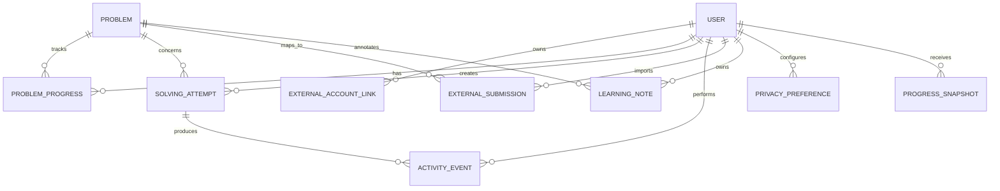

# Модель пользователя, активности, попыток и отправок

**Задача backlog:** P0-005  
**Статус:** завершено  
**Дата:** 14 августа 2026  
**Владельцы доменов:** `Identity`, `Learning Workspace`, `Analytics`  
**Связанные документы:** [модель каталога](DATABASE.md), [Codeforces API](../data/CODEFORCES_API.md), [архитектура](../architecture.md)

## 1. Цель

Эта модель описывает личную работу пользователя с задачами: создание попытки, изменение статуса, активное время, заметки, локальные запуски и внешние отправки. Она отделяет неизменяемые факты от редактируемых пользовательских материалов и от производных аналитических срезов. Поэтому пересчёт статистики, исправление ошибочно импортированной записи или изменение интерфейса не уничтожают источник данных и не требуют перезаписывать историю.

Модель вдохновляется, но не реализует полностью стандарт xAPI: в нём учебное событие выражается через actor, verb и object, а записи событий считаются неизменяемыми; исправление производится отдельным событием, а не тихим переписыванием факта.[1] OlimpHub использует тот же принцип для своего внутреннего журнала, с более строгой минимизацией личных данных.

> Аналитика не является источником истины. Источник истины — проверенные пользовательские и внешние события; `ProblemProgress`, временные итоги и графики являются перестраиваемыми проекциями.

## 2. Границы владения

| Модуль                | Владеет                                                                     | Не владеет                                                       |
| --------------------- | --------------------------------------------------------------------------- | ---------------------------------------------------------------- |
| `Identity`            | Пользователь, сессии, метод входа, настройки приватности, внешние аккаунты. | Логикой статуса задачи, аналитическими вычислениями и каталогом. |
| `Learning Workspace`  | Попытки, личные статусы, заметки, подборки, события учебного процесса.      | Каноническими данными задачи и внешним API источника.            |
| `Integrations`        | Импортированные внешние отправки и снимки внешних аккаунтов.                | Авторизацией пользователя и локальным кодом/заметками.           |
| `Analytics`           | Проекции прогресса, интервалы времени, агрегаты и объяснения расчёта.       | Редактированием исходных событий.                                |
| `Execution` (будущий) | Локальные запуски и технические вердикты в изолированной среде.             | Внешними отправками и пользовательским профилем.                 |

## 3. Сущности и связи

| Сущность              | Назначение                                                               | Ключевые поля                                                                                                       |
| --------------------- | ------------------------------------------------------------------------ | ------------------------------------------------------------------------------------------------------------------- |
| `User`                | Минимальная внутренняя идентичность личности.                            | `id`, `createdAt`, `accountStatus`, `primaryLocale`, `timeZone`.                                                    |
| `ExternalAccountLink` | Связь пользователя с handle на внешнем источнике.                        | `id`, `userId`, `sourceId`, `externalHandle`, `normalisedHandle`, `verificationStatus`, `linkedAt`, `lastSyncedAt`. |
| `ProblemProgress`     | Текущее личное состояние задачи, быстро читаемая проекция.               | `userId`, `problemId`, `status`, `firstStartedAt`, `lastActivityAt`, `solvedAt`, `sourceOfTruth`.                   |
| `SolvingAttempt`      | Одна осмысленная попытка решить конкретную задачу.                       | `id`, `userId`, `problemId`, `state`, `startedAt`, `endedAt`, `outcome`, `contextType`.                             |
| `ActivityEvent`       | Неизменяемый факт учебного взаимодействия.                               | `id`, `userId`, `attemptId`, `eventType`, `occurredAt`, `recordedAt`, `clientEventId`, `context`.                   |
| `LearningNote`        | Редактируемая личная заметка, отделённая от журнала событий.             | `id`, `userId`, `problemId`, `attemptId?`, `content`, `revision`, `updatedAt`.                                      |
| `ExternalSubmission`  | Нормализованный факт отправки на внешнем judge.                          | `sourceId`, `externalSubmissionId`, `externalAccountLinkId`, `problemId?`, `verdict`, `submittedAt`, `observedAt`.  |
| `ExecutionRecord`     | Будущий результат локального запуска в изолированном сервисе.            | `id`, `userId`, `attemptId`, `verdict`, `resourceUsage`, `createdAt`.                                               |
| `PrivacyPreference`   | Пользовательские настройки сбора, экспорта и хранения личной активности. | `userId`, `activityTracking`, `analyticsRetentionDays`, `dataExportRequestedAt`, `updatedAt`.                       |
| `ProgressSnapshot`    | Версионированная материализованная сводка для интерфейса.                | `id`, `userId`, `period`, `calculationVersion`, `generatedAt`, `metrics`.                                           |

## 4. Пользователь и внешние аккаунты

`User` использует внутренний ID и не делает email/логин частью доменных внешних ключей. Email, секреты входа, токены OAuth, session identifier и recovery data принадлежат защищённой инфраструктуре Identity и не попадают в `ActivityEvent`, аналитику или экспорт по умолчанию.

`ExternalAccountLink` не должен выдавать утверждение handle за доказательство владения аккаунтом. До появления явного разрешённого способа верификации `verificationStatus` принимает `declared_public`; это означает, что пользователь указал публичный handle, а не то, что OlimpHub получил контроль над внешним аккаунтом. Значения `verified` и `revoked` допустимы только после отдельного безопасного flow, который документирует доказательство и не хранит внешний пароль.

| Поле `ExternalAccountLink`    | Правило                                                                                                  |
| ----------------------------- | -------------------------------------------------------------------------------------------------------- |
| `sourceId + normalisedHandle` | Не может быть одновременно привязано к нескольким пользователям без разрешения процесса разбирательства. |
| `externalHandle`              | Отображаемое написание, полученное из источника; пользовательский ввод не заменяет его бесконтрольно.    |
| `verificationStatus`          | `declared_public`, `verified`, `stale`, `revoked`, `unavailable`.                                        |
| `syncConsent`                 | Явное согласие на импорт публичной истории; отзыв согласия прекращает будущую синхронизацию.             |
| `lastSyncedAt`                | Время последнего успешного завершённого импорта, не последней попытки.                                   |

## 5. Статус задачи и попытки

`ProblemProgress.status` — это текущая личная классификация, а не лог внешнего judge. Допустимые значения: `not_started`, `planned`, `in_progress`, `paused`, `solved`, `review`, `skipped` и `archived`. Пользователь может вручную изменить статус, но переходы фиксируются событием с причиной; импортированный Accepted не должен бесшумно переписывать ручной статус без определённой политики конфликта.

`SolvingAttempt` создаётся при явном старте, возобновлении или импорте попытки с контекстом `external_import`. Он не обязан содержать код: задача может решаться на бумаге, в IDE пользователя или на внешней платформе. Это важно для будущих математических задач. `state` описывает жизненный цикл `active`, `paused`, `completed`, `abandoned`, `superseded`; `outcome` описывает результат `solved`, `not_solved`, `partial`, `unknown` и доступен лишь по завершении.

| Сценарий                                | Изменение                                                                                                               | Событие                             |
| --------------------------------------- | ----------------------------------------------------------------------------------------------------------------------- | ----------------------------------- |
| Пользователь начинает задачу            | Создаётся `SolvingAttempt(active)` и `ProblemProgress(in_progress)`.                                                    | `attempt_started`                   |
| Пользователь ушёл и вернулся            | Состояние попытки меняется на `paused`/`active` без потери истории.                                                     | `attempt_paused`, `attempt_resumed` |
| Пользователь решил задачу вручную       | Обновляется проекция `solved`; результат имеет источник `user_declared`.                                                | `problem_marked_solved`             |
| Judge возвращает Accepted               | Создаётся/обновляется `ExternalSubmission`; политика может предложить статус `review`, но не уничтожает ручную историю. | `external_submission_observed`      |
| Пользователь признаёт ошибочную отметку | Текущий status меняется, старое событие остаётся, появляется корректирующее.                                            | `progress_corrected`                |

## 6. Журнал активности

`ActivityEvent` — append-only журнал. Он содержит минимальный проверяемый контекст, но **не** содержит нажатия клавиш, полный текст заметки, полный текст решения, токены сессии, IP-адрес в аналитической проекции или любые секреты. Клиент имеет `clientEventId` (UUID), чтобы повтор отправки при потере сети был идемпотентным: ограничение `UNIQUE(user_id, client_event_id)` действует, когда идентификатор задан.

| Категория             | События                                                                                          | Минимальный контекст                                                      |
| --------------------- | ------------------------------------------------------------------------------------------------ | ------------------------------------------------------------------------- |
| Навигация             | `problem_opened`, `problem_closed`, `search_executed`, `collection_opened`                       | `problemId?`, `collectionId?`, источник маршрута.                         |
| Попытка               | `attempt_started`, `attempt_paused`, `attempt_resumed`, `attempt_completed`, `attempt_abandoned` | `attemptId`, `problemId`, причина перехода.                               |
| Редактор              | `editor_focus_changed`, `editor_activity_heartbeat`                                              | `attemptId`, `focused`, агрегированная длительность; без keystrokes/кода. |
| Подсказки и материалы | `hint_requested`, `hint_revealed`, `editorial_opened`                                            | уровень подсказки/материала, без текста.                                  |
| Решение               | `problem_status_changed`, `submission_created`, `external_submission_observed`                   | старый/новый status, ID записи, verdict.                                  |
| Тренировка            | `training_started`, `training_item_opened`, `training_completed`                                 | `trainingSessionId`, `problemId?`.                                        |
| Приватность           | `tracking_consent_changed`, `data_export_requested`, `activity_purged`                           | новая настройка и число обработанных записей.                             |

Событие получает `occurredAt` от клиента и `recordedAt` от сервера. Сервер принимает клиентское время только в разумном окне, сохраняет исходное значение отдельно при диагностической необходимости и использует `recordedAt` для детерминированной сортировки спорных событий. Будущие интервалы активности считаются серверной проекцией из focus/heartbeat с ограничением на максимальный непрерывный промежуток; браузерное событие само по себе не доказывает, что пользователь работал.

## 7. Внешние и локальные отправки

`ExternalSubmission` — это снимок факта у источника. Он имеет уникальность `UNIQUE(source_id, external_submission_id)`, а связь с пользователем проходит через `ExternalAccountLink`. Код не импортируется по умолчанию: официальный метод Codeforces `user.status` делает `includeSources` доступным лишь для собственной учётной записи, поэтому MVP не должен полагаться на получение/хранение исходников внешнего judge.[2]

| Поле                         | Правило                                                                                                                                                                                         |
| ---------------------------- | ----------------------------------------------------------------------------------------------------------------------------------------------------------------------------------------------- |
| `externalSubmissionId`       | Непрозрачный внешний идентификатор, основной ключ идемпотентности.                                                                                                                              |
| `externalProblemRefId`       | Исходная связь с каталогом; `problemId` заполняется, когда сопоставление надёжно.                                                                                                               |
| `verdict`                    | Сохраняется исходное значение и нормализованный enum: `accepted`, `wrong_answer`, `time_limit`, `memory_limit`, `runtime_error`, `compilation_error`, `partial`, `other`, `pending`, `unknown`. |
| `language`                   | Метаданные среды, если предоставляет источник; не участвуют в определении навыка без отдельной политики.                                                                                        |
| `submittedAt` / `observedAt` | Время выполнения на источнике и время импорта не смешиваются.                                                                                                                                   |
| `rawCode`                    | Не сохраняется. В будущем собственный редактор хранится отдельно, с отдельным согласием и политикой ретенции.                                                                                   |

`ExecutionRecord` не является `ExternalSubmission`. Он создаётся только будущим изолированным сервисом выполнения, с техническими лимитами и доказуемой связью с `SolvingAttempt`. Изменение вердикта внешнего judge после rejudge фиксируется как новая версия наблюдения и не изменяет исходный факт отправки задним числом.

## 8. Проекции и аналитика

Обработчик outbox читает утверждённые события и обновляет проекции: `ProblemProgress`, активные интервалы, дневные/недельные агрегаты и `ProgressSnapshot`. Проекция хранит `calculationVersion`, `sourceEventWatermark` и время генерации; поэтому её можно удалить и пересчитать без потери фактов.

Все объяснения в UI ссылаются на источник: например, «2 задачи решены в графах за 7 дней» должно указывать период, статусы/вердикты, использованные события и неполноту данных. Аналитика не имеет права генерировать вывод «освоен навык» или «решено за N минут», если нет достаточных событий либо пользователь отключил relevant tracking.

## 9. Приватность, экспорт и ретенция

| Категория данных                    | Значение по умолчанию                                    | Ретенция и контроль                                                                                               |
| ----------------------------------- | -------------------------------------------------------- | ----------------------------------------------------------------------------------------------------------------- |
| Аккаунт и сессия                    | Необходимы для сервиса.                                  | Отдельная политика Identity; сессии имеют срок жизни и отзыв.                                                     |
| Текущий прогресс и попытки          | Хранятся для личного обучения.                           | Удаляются/экспортируются по запросу пользователя согласно будущей политике.                                       |
| Детализированная activity telemetry | Включается прозрачно; без содержимого кода/заметок.      | Настраиваемый срок; агрегаты содержат только необходимые метрики.                                                 |
| Внешние отправки                    | Импортируются только после явного связывания и согласия. | Синхронизация прекращается при отзыве согласия; удаление/экспорт учитывают права источника.                       |
| Заметки и собственный код           | Приватны по умолчанию.                                   | Шифрование на уровне хранилища при необходимости, строгая server-side authorisation, отдельная политика экспорта. |

Удаление сырого `ActivityEvent` не должно создавать ложные агрегаты: прежде удаляется/пересчитывается зависимая проекция, затем создаётся аудит-событие без персонального содержимого. Юридические сроки и полный механизм удаления аккаунта остаются обязательной задачей безопасности до публичного запуска.

## 10. Проверяемые критерии будущей реализации

| Критерий                                                                           | Тест                                                                                                                            |
| ---------------------------------------------------------------------------------- | ------------------------------------------------------------------------------------------------------------------------------- |
| Пользователь A не читает и не меняет попытку, заметку или прогресс пользователя B. | Интеграционный авторизационный тест для каждого изменяющего endpoint.                                                           |
| Повтор `clientEventId` не удваивает активность.                                    | Конкурентный тест на повторную доставку события.                                                                                |
| Исправление статуса не удаляет исходное событие.                                   | Тест: два события, корректная текущая проекция и полный audit trail.                                                            |
| Внешняя отправка повторно импортирована.                                           | В БД одна запись по `sourceId + externalSubmissionId`.                                                                          |
| Внешняя отправка без сопоставленной задачи.                                        | Факт сохраняется с `externalProblemRefId`, а аналитика не приписывает его произвольной задаче.                                  |
| В activity context передан текст кода или заметки.                                 | Схема отклоняет/санитизирует поле; лог не содержит содержимого.                                                                 |
| Клиент прислал время далеко в будущем.                                             | Сервер помечает событие, использует безопасный `recordedAt` и не раздувает активное время.                                      |
| Tracking отключён.                                                                 | Новая несущественная telemetry не записывается; базовые события, нужные для текущей функциональности, документированы отдельно. |

## 11. Последствия для backlog

P0-006 использует подтверждённые `ProblemSkillLink` и проекции событий для объяснимой оценки навыков. Phase 4 реализует `ExternalAccountLink` и `ExternalSubmission` в соответствии с этим документом. Phase 6 добавляет сбор heartbeat, правила idle и privacy controls, не меняя базовую модель. Phase 5 добавляет `ExecutionRecord` только после завершения модели угроз выполнения кода.

## References

[1]: https://raw.githubusercontent.com/adlnet/xAPI-Spec/master/xAPI-Data.md "ADL — Experience API Data"
[2]: https://codeforces.com/apiHelp/methods "Codeforces API — Methods"
