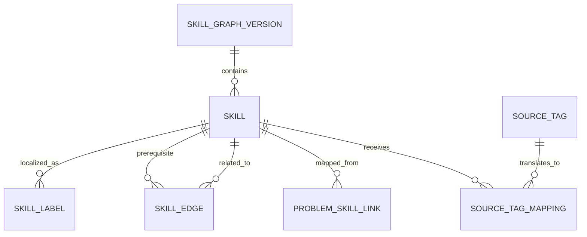

# Таксономия навыков и граф зависимостей

**Задача backlog:** P0-006  
**Статус:** завершено  
**Дата:** 14 августа 2026  
**Владелец домена:** `Skill Map`  
**Связанные документы:** [модель каталога](DATABASE.md), [модель учебных данных](LEARNING_DATA.md)

## 1. Решение

OlimpHub использует **полиерархическую версионируемую карту навыков**. Дерево недостаточно: задача на кратчайшие пути может одновременно требовать графы, жадные инварианты и оценку сложности; задача по комбинаторике может относиться и к математике, и к динамическому программированию. Поэтому навыки имеют несколько классификационных отношений, а строгое отношение `prerequisite_of` образует направленный ациклический граф (DAG).

### Статус реализации P1-701

Первый опубликованный снимок `1.0.0` создан миграцией `0008_normal_snowbird`; миграция `0009_lumpy_hammerhead` материализует его 11 утверждённых алгоритмических навыков как immutable `skill_graph_memberships`. Поле `introducedInGraphVersionId` хранит происхождение stable skill, а membership snapshot хранит его присутствие в конкретной версии. Поэтому будущая версия может включить тот же skill, не перезаписывая его принадлежность к `1.0.0`. Миграция `0010_seed_mathematics_skill_taxonomy` публикует `1.1.0`: сохраняет все алгоритмические membership и добавляет curated математику как отдельную taxonomy-only ветвь. Она не добавляет source-tag mappings, problem links, mastery evidence или автоматические рекомендации. Миграция `0011_slim_stellaris` вводит immutable `skill_edge_graph_memberships`: каждая опубликованная версия показывает только собственные зависимости, а `findPrerequisiteCycle` проверяет, что prerequisite-подграф остаётся DAG и возвращает замкнутый путь при цикле. Защищённый `skills.map` выдаёт только узлы, связи и problem-link записи выбранной опубликованной версии и показывает semantic version с change summary в интерфейсе Skill Map. Source-tag translation остаётся отдельной работой.

Такой подход согласуется с тем, что ACM Computing Classification System описан как полиерархическая онтология, способная меняться со временем.[1] Тематические разделы CSES подтверждают практическую ценность крупных навигационных групп — графы, динамика, деревья, математика, строки и геометрия,[2] — но не являются готовой педагогической моделью и не копируются как единственный источник истины.

> Внешний тег — это свидетельство источника. Навык OlimpHub — это управляемая учебная компетенция. Между ними всегда есть явное, проверяемое сопоставление.

## 2. Цели и нецели

| Цели                                                                                       | Нецели                                                                     |
| ------------------------------------------------------------------------------------------ | -------------------------------------------------------------------------- |
| Структурировать каталог, тренировку и объяснимую аналитику.                                | Оценивать интеллект, талант или профессиональную пригодность пользователя. |
| Поддержать алгоритмическое программирование сейчас и математику без миграции модели позже. | Подменять знания пользователя одной цифрой «уровня».                       |
| Сохранять источник, уверенность и версию каждого сопоставления.                            | Автоматически считать чужие теги безошибочными.                            |
| Выражать несколько путей к навыку и зависимости между ними.                                | Строить произвольный циклический «граф знаний».                            |
| Делать рекомендации объяснимыми по событиям пользователя.                                  | Использовать LLM как непрозрачный калькулятор базовой статистики.          |

## 3. Данные Skill Map

| Сущность            | Назначение                                                    | Ключевые поля                                                                       |
| ------------------- | ------------------------------------------------------------- | ----------------------------------------------------------------------------------- |
| `SkillGraphVersion` | Набор утверждённых навыков и рёбер на момент расчёта.         | `id`, `semanticVersion`, `status`, `publishedAt`, `changeSummary`.                  |
| `Skill`             | Стабильная учебная компетенция.                               | `id`, `stableKey`, `domain`, `kind`, `difficultyBand`, `status`, `graphVersionId`.  |
| `SkillLabel`        | Локализованное имя и краткое объяснение.                      | `skillId`, `locale`, `name`, `description`.                                         |
| `SkillEdge`         | Направленная или симметричная семантическая связь.            | `fromSkillId`, `toSkillId`, `relationType`, `strength`, `status`, `graphVersionId`. |
| `ProblemSkillLink`  | Связь задачи с навыком.                                       | `problemId`, `skillId`, `relevance`, `origin`, `confidence`, `reviewStatus`.        |
| `SourceTag`         | Наблюдаемый тег конкретного источника.                        | `sourceId`, `rawValue`, `normalisedValue`, `locale`.                                |
| `SourceTagMapping`  | Управляемый перевод тега источника в навык.                   | `sourceTagId`, `skillId`, `relation`, `confidence`, `origin`, `reviewStatus`.       |
| `SkillEvidence`     | Производная объяснимая запись, почему изменена оценка навыка. | `userId`, `skillId`, `eventId`, `weight`, `reasonCode`, `calculationVersion`.       |

`stableKey` не зависит от локализованного названия и имеет вид `algorithms.graphs.shortest-paths` или `mathematics.number-theory.modular-arithmetic`. При переименовании сохраняется тот же ключ; при смысловом разделении старый навык выводится из употребления, а переход фиксируется миграцией карты, а не скрытым переписыванием истории.

## 4. Семантика связей

| `relationType`        | Направление         | Значение                                                                         | Ограничение                                                                        |
| --------------------- | ------------------- | -------------------------------------------------------------------------------- | ---------------------------------------------------------------------------------- |
| `contains`            | родитель → дочерний | Навигационная/педагогическая группировка.                                        | Может образовывать полиерархию, но не используется как prerequisite автоматически. |
| `prerequisite_of`     | предпосылка → навык | Базовая компетенция обычно нужна до освоения следующей.                          | Подграф должен быть DAG; любая попытка создать цикл отклоняется.                   |
| `related_to`          | симметричное        | Навыки часто появляются вместе, но один не является условием другого.            | Хранится в каноническом порядке ID.                                                |
| `alternative_path_to` | навык → навык       | Одна компетенция может компенсировать другой набор предпосылок в контексте темы. | Не повышает mastery автоматически.                                                 |
| `refines`             | общее → узкое       | Более узкий навык уточняет общий.                                                | Не означает, что высокая оценка узкого навыка равна высокой общей оценке.          |

Изменение edge в опубликованной версии не пересчитывает исторический отчёт задним числом: `SkillEvidence` и `ProgressSnapshot` сохраняют `calculationVersion` и `skillGraphVersion`.

## 5. Стартовая карта алгоритмического программирования

Это исходный **каталог ключей**, а не завершённый список каждой техники. Новые навыки добавляются только с определением, местом в карте, хотя бы одной обоснованной связью и миграционной заметкой.

| Корневая область                 | Основные ветви                                           | Примеры leaf-навыков                                                                      |
| -------------------------------- | -------------------------------------------------------- | ----------------------------------------------------------------------------------------- |
| `foundations`                    | сложность, корректность, реализация                      | асимптотика, инварианты, контрпримеры, переполнение, ввод-вывод, отладка.                 |
| `data-structures`                | линейные, поисковые, диапазонные, деревья структур       | stack/queue/deque, hash map, DSU, Fenwick tree, segment tree, sparse table, heap.         |
| `algorithms.search-and-order`    | сортировка, бинарный поиск, two pointers, sweep line     | lower/upper bound, параметрический поиск, скользящее окно, coordinate compression.        |
| `algorithms.dynamic-programming` | состояния, оптимизации, подмножества, последовательности | knapsack, LIS/LCS, bitmask DP, digit DP, tree DP, interval DP.                            |
| `algorithms.graphs`              | обходы, связность, деревья, пути, потоки                 | BFS/DFS, topological sort, SCC, shortest paths, MST, LCA, max flow, matching.             |
| `algorithms.strings`             | базовая обработка, поиск, структуры строк                | prefix function, Z-function, trie, suffix array, suffix automaton, rolling hash.          |
| `algorithms.geometry`            | представление, ориентация, пересечения, выпуклость       | cross product, line intersection, point-in-polygon, convex hull, rotating calipers.       |
| `algorithms.combinatorial`       | перебор, meet-in-the-middle, игры, constructive          | backtracking, pruning, Grundy, inclusion-exclusion, constructive algorithms.              |
| `mathematics-for-programming`    | теория чисел, комбинаторика, вероятность, алгебра        | sieve, gcd/extgcd, modular inverse, CRT, binomial coefficients, expected value, matrices. |
| `contest-practice`               | моделирование, чтение, распределение времени, анализ     | декомпозиция условия, выбор ограничения, оценка тестов, послесоревновательный разбор.     |

### Ключевые prerequisite-цепочки

| Целевой навык                                   | Минимальные предпосылки                                                                                         | Почему                                                                          |
| ----------------------------------------------- | --------------------------------------------------------------------------------------------------------------- | ------------------------------------------------------------------------------- |
| `algorithms.graphs.shortest-paths.dijkstra`     | `foundations.complexity`, `data-structures.heap`, `algorithms.graphs.traversal`                                 | Нужны оценка сложности, приоритетная очередь и базовая модель графа.            |
| `algorithms.graphs.trees.lca`                   | `algorithms.graphs.trees.rooting`, `algorithms.graphs.traversal`, `algorithms.search-and-order.binary-search`   | Дерево нужно укоренить; распространённые реализации используют двоичный подъём. |
| `algorithms.dynamic-programming.bitmask`        | `algorithms.dynamic-programming.state-design`, `foundations.bit-operations`                                     | Состояние кодируется подмножеством.                                             |
| `data-structures.range.segment-tree`            | `data-structures.range.prefix-sums`, `algorithms.divide-and-conquer`, `foundations.invariants`                  | Понимание агрегата и инварианта узла важно для корректности.                    |
| `mathematics-for-programming.number-theory.crt` | `mathematics-for-programming.number-theory.gcd`, `mathematics-for-programming.number-theory.modular-arithmetic` | Связь модулей строится на gcd и сравнениях.                                     |
| `algorithms.strings.suffix-array`               | `algorithms.strings.pattern-matching`, `algorithms.search-and-order.sorting`, `foundations.complexity`          | Требует представления строк и сортировочного мышления.                          |

## 6. Перспективная карта математических олимпиад

Математика — полноценный `domain=mathematics`, а не tag у программирования. Это сохраняет общие навыки (доказательство, комбинаторное мышление), но не заставляет доказывать теоремы через модель исходного кода.

| Ветвь                       | Подветви                                                           | Примеры навыков                                                                             |
| --------------------------- | ------------------------------------------------------------------ | ------------------------------------------------------------------------------------------- |
| `mathematics.algebra`       | многочлены, уравнения, неравенства, функциональные уравнения       | разложение, Vieta, оценка AM-GM, инвариант функционального уравнения.                       |
| `mathematics.number-theory` | делимость, сравнения, диофантовы уравнения, p-adic/оценки          | gcd, модульная арифметика, порядки, LTE, китайская теорема.                                 |
| `mathematics.combinatorics` | подсчёт, принцип Дирихле, инварианты, экстремальный принцип, графы | inclusion-exclusion, double counting, pigeonhole, extremal argument.                        |
| `mathematics.geometry`      | евклидова, аффинная, проективная, преобразования                   | подобие, окружности, power of a point, barycentric/coординаты.                              |
| `mathematics.probability`   | вероятностные модели, ожидание, инварианты случайности             | условная вероятность, линейность ожидания, martingales — после базовой валидации программы. |
| `mathematics.proof`         | логика, кванторы, построение доказательства, контрпример           | прямое/от противного/индукция, case analysis, proof audit.                                  |

На старте математика не участвует в автоматических рекомендациях алгоритмических задач, пока не появятся собственные типы попыток, критерии завершения и источники с проверенными правами. Она уже поддерживается `Problem.kind=mathematics` и `ProblemSkillLink` из модели каталога.

## 7. Сопоставление внешних тегов

Внешний тег всегда проходит через `SourceTagMapping`. Пример: Codeforces `dp` может иметь approved mapping на `algorithms.dynamic-programming.state-design` с малой/средней релевантностью, но не доказывает наличие конкретного leaf-навыка `digit-dp`. Один тег может соответствовать нескольким навыкам; одна задача может быть связана с несколькими навыками.

| `origin`           | Когда допустим                                                      | Требование к UI/аналитике                                                    |
| ------------------ | ------------------------------------------------------------------- | ---------------------------------------------------------------------------- |
| `source_tag_rule`  | Детерминированное задокументированное сопоставление тега источника. | Отображать как «на основе тега источника», не как педагогическую экспертизу. |
| `curator`          | Ручная оценка с указанием проверившего и версии.                    | Высокая уверенность после review; audit trail обязателен.                    |
| `model_suggestion` | Будущая модель предложила гипотезу.                                 | Не используется в рекомендациях или mastery без approved review.             |
| `user_annotation`  | Пользователь добавил личную метку.                                  | Отделена от общей карты и не изменяет другие аккаунты.                       |

## 8. Измерение mastery: интерфейс с будущим движком

Карта навыков не хранит одно итоговое число как первичный факт. `SkillEvidence` выражает вклад конкретного события: решение задачи, попытка, использование подсказки, внешняя Accepted-отправка, время с последней практики. P1-704 реализует начальную детерминированную функцию `skill-mastery-v1`: она использует только owner-scoped solved progress, связанный с approved `ProblemSkillLink` в опубликованной версии графа. Два независимых solved problem требуются до первого estimate; при меньшем количестве результатом остаётся `insufficient_evidence`. P1-705 заменяет её на `skill-mastery-v2`: verified difficulty, количество owner attempts, highest released hint level и solved recency влияют только после выполнения direct-evidence threshold. `related_to` в текущей published версии добавляет не более пяти points и не может преобразовать `insufficient_evidence` в estimate; prerequisite propagation намеренно не включена.

Минимальные требования объяснимости:

1. Любая оценка показывает период, версию расчёта, достаточность данных и три главных фактора.
2. Отсутствие активности означает `insufficient_evidence`, а не «низкий уровень».
3. Одна Accepted-отправка не является доказательством mastery: учитываются сложность, независимые попытки, подсказки, недавность и связи навыков.
4. Проникновение по `prerequisite_of` ограничено и документировано; оно не копирует оценку дочернего навыка на родителя 1:1.
5. LLM может объяснить уже рассчитанные причины человеческим языком, но не создаёт числовые evidence без фактов.

P1-706 supplies those reasons directly from the deterministic result. `insufficient_direct_evidence` reports only the count against the two-solved threshold. Estimated results rank up to three non-zero contributors among direct solved evidence, problem difficulty, deliberate attempts, released-hint adjustment, recent practice and bounded `related_to` context. The reason projection contains no problem statement, note, hint content, code or full solution.

P1-707 renders the current published snapshot’s verified `prerequisite_of` edges as a layered SVG graph. Arrow direction always points toward the dependent skill, and node labels retain the approved skill title. The pre-existing textual prerequisite-path list remains below the graph as a readable fallback; neither visual form creates or infers relationships not contained in the versioned edge snapshot.

## 9. Управление изменениями и качество графа

Новая версия карты публикуется только после проверки: уникальности stable key, валидных локалей, отсутствия циклов в prerequisite-графе, отсутствия self-edge, понятного определения новых навыков и миграционной заметки. Удаление навыка заменяется `deprecated`-статусом и relation `replaced_by`; старые отчёты остаются читаемыми.

| Проверка                                      | Ожидаемый результат                                                       |
| --------------------------------------------- | ------------------------------------------------------------------------- |
| Добавить `prerequisite_of` с циклом.          | Транзакция отклоняется с путём найденного цикла.                          |
| Добавить второй `Skill` с тем же `stableKey`. | Ограничение уникальности отклоняет запись.                                |
| Сопоставить задачу с неутверждённым навыком.  | Связь остаётся draft и не участвует в расчётах.                           |
| Изменить опубликованную карту.                | Требуется новая `SkillGraphVersion`; история не перезаписывается.         |
| Источник прислал неизвестный тег.             | Создаётся наблюдение/raw tag без автоматической публикации нового навыка. |

## 10. Последствия для roadmap

P1-701 реализует алгоритмический стартовый набор и версионирование; P1-702 активирует математические ветви после оценки источников; P1-703 реализует хранение DAG и проверку циклов. P1-704—P1-708 используют только утверждённые `Skill`, edges и `SkillEvidence`. P1-304 добавляет правила сопоставления задач с навыками, не затрагивая исходные теги источников.

## References

[1]: https://dl.acm.org/ccs "ACM Computing Classification System"
[2]: https://cses.fi/problemset/ "CSES — Problem Set"
