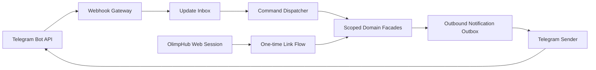

# Архитектура Telegram-интеграции

**Задача backlog:** P0-009  
**Статус:** завершено  
**Дата:** 14 августа 2026  
**Владельцы доменов:** `Notifications`, `Identity`, `Training`, `AI Coach`  
**Связанные документы:** [учебные данные](LEARNING_DATA.md), [AI Coach](AI_ARCHITECTURE.md)

## 1. Решение

Telegram — это дополнительный канал для коротких действий и напоминаний, а не альтернативный административный интерфейс. Первая версия поддерживает приватный диалог с ботом, безопасное связывание аккаунта, команду текущей тренировки, краткую сводку прогресса, открытие задачи во web-интерфейсе и низкоуровневую подсказку. Все чувствительные действия и полный разбор остаются в авторизованном веб-приложении.

Интеграция использует HTTPS webhook в production. Telegram определяет два взаимоисключающих способа получения updates — `getUpdates` и webhook, хранит входящие updates не более 24 часов и предоставляет `update_id` для игнорирования повторов и восстановления порядка.[1] Поэтому production не использует polling параллельно с webhook и обрабатывает delivery как at-least-once: update сохраняется идемпотентно до начала доменной обработки.

> Сообщение Telegram — недоверенный ввод. Chat ID доказывает только адрес доставки в Telegram, но не даёт доступа к данным OlimpHub, пока пользователь не завершит отдельное связывание с уже авторизованной учётной записью.

## 2. Границы компонентов

| Компонент | Ответственность | Не имеет права |
|---|---|---|
| `Webhook Gateway` | Проверить секретный заголовок, лимит/размер, распарсить JSON, дедуплицировать update и быстро подтвердить получение. | Выполнять долгую бизнес-логику, обращаться к AI provider или отправлять сообщение синхронно. |
| `Update Inbox` | Надёжно сохранить update metadata/payload с TTL и состоянием обработки. | Хранить бот-токен или личные данные дольше политики ретенции. |
| `Command Dispatcher` | Разобрать команду/callback, получить связанный account и вызвать только разрешённый сценарий. | Принимать `userId` из текста команды или callback как источник авторизации. |
| `Scoped Domain Facade` | Вернуть узкую проекцию тренировки, progress или ссылки. | Отдавать чужие данные, полный каталог без scope или сырые таблицы. |
| `Notification Outbox` | Подготовить идемпотентную доставку напоминаний и отчётов. | Отправлять без preference/quiet-hours проверки. |
| `Telegram Sender` | Ограничить скорость, обработать `ok=false`, retry и статус доставки. | Логировать токен, полный личный текст или обойти блокировку пользователя. |
| `One-time Link Flow` | Привязать Telegram identity к текущей web-сессии после явного подтверждения. | Создавать веб-аккаунт только по chat ID. |

## 3. Входящий webhook-контракт

Telegram отправляет Update как JSON HTTPS POST и повторяет webhook request при не-2xx ответе.[1] `setWebhook` позволяет передать `secret_token`; Telegram затем отправляет его в заголовке `X-Telegram-Bot-Api-Secret-Token`.[1] Этот заголовок — обязательная защита от случайного/враждебного POST на endpoint, но не заменяет валидацию схемы, limits и идемпотентность.

| Шаг | Серверное действие | Отказ/результат |
|---:|---|---|
| 1 | Принять только POST HTTPS на точный path; ограничить body size и read timeout. | Неверный метод/content type/размер — 4xx без разбора. |
| 2 | Сравнить secret header с серверным secret в constant time. | Несовпадение — 401/403, без указания причины. |
| 3 | Провалидировать JSON Update по закрытой схеме и allowlist `allowed_updates`. | Некорректный JSON — 400; неизвестные поля не получают неявных прав. |
| 4 | Записать `TelegramUpdateInbox(botId, updateId)` в транзакции. | Уникальный конфликт означает повтор: вернуть 200 без второго выполнения. |
| 5 | Поместить command job/outbox в ту же транзакцию. | Успех — 200 после durable acceptance; временная ошибка БД — 5xx для retry. |
| 6 | Worker выполняет команду асинхронно с correlation ID. | Ошибка даёт безопасное исходящее сообщение/observability; webhook не блокируется. |

Ограничение уникальности `UNIQUE(bot_id, update_id)` является основной защитой от повторной доставки. `update_id` обычно увеличивается последовательно, но после недели без новых updates следующий идентификатор может быть случайным,[1] поэтому он не используется как единственный глобальный порядок или курсор бизнес-данных.

## 4. Связывание аккаунта

Связь Telegram с OlimpHub создаётся только в web-сессии или через одноразовый cryptographically random linking code. Бот не получает пароль, cookie, OAuth token или API key пользователя.

| Шаг | Поток |
|---:|---|
| 1 | В веб-приложении авторизованный пользователь выбирает «Подключить Telegram». |
| 2 | Сервер создаёт короткоживущий одноразовый `TelegramLinkIntent`: `intentId`, user ID, expiry, nonce, состояние `pending`; в deep link уходит только непрозрачный код. |
| 3 | Пользователь открывает `https://t.me/{bot}?start={opaqueCode}` и отправляет `/start`. |
| 4 | Gateway связывает Telegram user/chat с intent только после проверки срока, одноразовости и соответствия bot ID. |
| 5 | Веб-интерфейс показывает финальное подтверждение, какую Telegram-учётную запись и chat он подключает. |
| 6 | Сервер создаёт `TelegramAccountLink` и инвалидирует intent. |

`TelegramAccountLink` хранит Telegram numeric `userId` в 64-bit safe представлении, `privateChatId`, `linkedAt`, `status`, `lastInboundAt`, `lastOutboundAt` и `notificationPreferences`. Handle/username Telegram не является ключом, потому что может меняться или отсутствовать. Один Telegram identity не может быть связан с несколькими OlimpHub users без отдельного управляемого recovery flow; unlink требует web-authentication и отзывает будущие notifications.

## 5. Команды и интерактивность

| Команда/действие | Результат | Авторизация и ограничение |
|---|---|---|
| `/start` | Объяснение, запрос на linking или приветствие уже связанного пользователя. | Не отображает профиль или статистику до link. |
| `/today` | Активная тренировка/следующий согласованный шаг с deep link. | Только собственная краткая проекция. |
| `/stats` | Короткая сводка с периодом и ссылкой на полный dashboard. | Только агрегаты с sufficient-data flags. |
| `/training` | Открывает текущую тренировку и предлагает перейти в web UI. | Не создаёт внезапно новую тренировку без подтверждения. |
| `/problem` | Ссылка на выбранную/активную задачу. | Учитывает source access mode; не копирует restricted statement. |
| `/hint` | Запрашивает подсказку уровня не выше текущего server-side disclosure ceiling. | Только для активной попытки; full solution запрещён в Telegram learning flow. |
| `/progress` | Статус цели/последняя активность. | Не делает выводов без фактов. |
| Inline callback | Выбор уровня hint, открыть задачу, snooze reminder. | Callback data — подписанный/opaque action ID с TTL; никогда не содержит незашифрованный user ID или произвольную команду. |

Групповые чаты отключены в MVP для персональных команд и уведомлений. Если бот добавлен в группу, он отвечает только с нейтральной подсказкой перейти в приватный диалог и не раскрывает связанный профиль, activity, цели, задачи или напоминания.

## 6. Notifications и пользовательская воля

Уведомления создаются доменными событиями через outbox: `training_due`, `reminder_due`, `streak_at_risk`, `contest_summary_ready`, `weekly_report_ready`. Sender проверяет связанный `TelegramAccountLink`, предпочтения категории, quiet hours, timezone, rate/burst limits, статус блокировки и idempotency key до внешнего вызова.

Каждая отправка имеет `NotificationDelivery` с `notificationId`, `channel=telegram`, `chatId`, `idempotencyKey`, `status`, `attemptCount`, `nextAttemptAt` и минимальным diagnostic code. Отправленный текст может быть воспроизведён из доменного события, а не храниться бесконечно. «Отключить уведомления» доступно одной явной командой/кнопкой и в web settings; opt-out прекращает новые delivery до повторного согласия.

Точные численные лимиты Telegram не должны быть зашиты как неподтверждённый факт. Sender применяет консервативные конфигурируемые per-chat и global token bucket, уважает официальный error response/параметры повторной попытки и использует backoff с jitter. При `ok=false` отправка классифицируется как retryable, permanently undeliverable (например, blocked bot) или configuration error без сообщения пользователю через бесконечный retry.

## 7. Секреты, защита и приватность

| Риск | Контроль |
|---|---|
| Утечка bot token | Token хранится только в secret manager, не входит в URL/логи/клиент; компрометация ведёт к немедленному revoke/rotate и reset webhook. |
| Поддельный webhook | HTTPS + secret header + constant-time compare + schema validation + network-level protection. |
| Повтор update | `UNIQUE(bot_id, update_id)`, inbox/outbox и idempotent handlers. |
| Command injection | Закрытый grammar команд, лимит длины, callback allowlist, no shell/SQL/URL execution из текста. |
| Лишние update types | Явный `allowed_updates` только для `message` и `callback_query` в MVP. |
| Утечка персональных данных в группе | Личные команды работают только в private chat; group events не получают user context. |
| Небезопасный Markdown | Выходные данные экранируются/форматируются по поддерживаемому режиму Telegram; внешние тексты не рендерятся как trusted markup. |
| Prompt injection для AI hint | Текст команды и внешнего условия остаются данными; `/hint` вызывает AI Coach только с минимальным context и текущим disclosure ceiling. |
| Спам/абьюз | Rate limits по Telegram identity/chat, command cooldown, per-user budget, аудит подозрительных repeated failures. |

Telegram token равен полному доступу к Bot API, поскольку официальный endpoint формируется с `<token>` в URL.[1] Поэтому HTTP client и telemetry обязаны redaction-ить path/query до записи ошибок. `getWebhookInfo` используется только server-side health check; его human-readable error fields не отображаются пользователю без sanitization.

## 8. Наблюдаемость и эксплуатация

Метрики: количество accepted/duplicate/invalid updates, latency до durable acceptance, inbox backlog, command success/failure, outgoing queue delay, Telegram error class, blocked delivery, webhook pending updates, link conversion/expiry и notification opt-out. Логи содержат correlation ID, hashed Telegram user/chat identifier и type command, но не raw message, bot token, deep-link code или полный callback data.

Webhook deployment требует public HTTPS endpoint и поддерживаемый порт Telegram. Официальная спецификация описывает webhook как HTTPS URL и перечисляет поддерживаемые порты 443, 80, 88 и 8443.[1] Health check после deployment проверяет `getWebhookInfo.url`, `pending_update_count`, allowed update types и отсутствие `last_error_message` без вывода секрета.

## 9. Тесты и критерии готовности

| Сценарий | Проверка |
|---|---|
| Повтор идентичного `update_id` | Только один domain command и один outbound idempotency key. |
| Поддельный POST без/с неверным secret | Gateway отвечает отказом и не создаёт inbox record. |
| Callback с подменённым action | Signature/TTL validation отклоняет его без доступа к данным. |
| `/stats` из group chat | Нет личных данных; только нейтральный ответ или игнорирование согласно policy. |
| Истёкший deep-link code | Link не создаётся; пользователь получает безопасную инструкцию начать flow заново. |
| Бот заблокирован | Delivery получает final status, новые retry не создаются до нового inbound signal/relink. |
| Telegram 429/5xx | Sender применяет backoff/retry без потери исходного domain event. |
| `/hint` в learning mode | Результат не превосходит server-side hint level и не содержит solution outline/code. |
| Token в exception message | Redaction test подтверждает отсутствие токена в логах и audit. |

## 10. Внешние зависимости и порядок реализации

P1-1101—P1-1108 требуют bot token от BotFather, управляемый secret store, публичный HTTPS endpoint и deployment owner. Эти ресурсы отсутствуют на этапе документации, поэтому в backlog добавлена P0-009a как блокер инфраструктурного включения. Архитектура и unit/contract tests могут быть реализованы раньше на зафиксированных Update fixtures, но нельзя объявлять интеграцию готовой или эмулировать реальную доставку без webhook verification.

Порядок: создать identity/link domain → inbox/outbox → webhook security → `/start` и link flow → read-only команды `/today`/`/stats` → preferences → notifications → `/hint` с AI policy. Полный набор команд из Phase 11 реализуется только после стабилизации соответствующих доменных функций.

## References

[1]: https://core.telegram.org/bots/api "Telegram Bot API"
